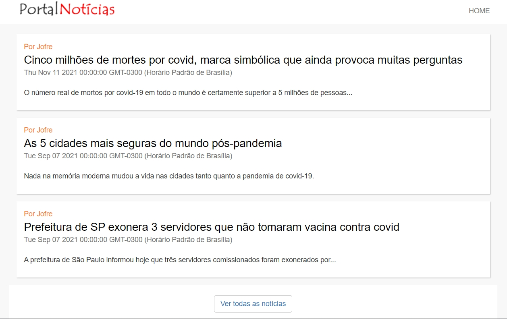

# Site de Notícias
# Desenvolvedor: Igor Fernandes

- O objeto foi produzir um pequeno site de noticías utilizando o modelo MVC e Node.js.

## Apresentação:

## 🔗 Grade de conteúdos:

- [Recursos](#recursos)
- [Arquitetura](#arquitetura)
- [Instruções](#instruções)

============================//================//===========

## ⚡ RECURSOS:

### [RECURSOS] - Styles
- [Css]

## 📂 ARQUITETURA

###  [ARQUITETURA] - Bit/Git

<table>
    <thead>
        <tr>
            <td>
                Directório
            </td>
        <tr>
    </thead>
    <tbody>
        <tr>
            <td> assets </td>
            <td> config </td>
            <td> data </td>
            <td> inc </td>
            <td> node_modules </td>
        </tr>
        <tr>
            <td> CSS ~ images ~ js</td>
            <td> ... </td>
            <td> controllers ~ models</td>
            <td> rout ~ view </td>
            <td> ... </td>
        </tr>

    </tbody>
</table>

## 📂 INSTRUÇÕES

### [INSTRUÇÕES] - Instalação 
<pre>
-  Apenas utilize a versão 14.0.0 do node.js para executar a instalação no npm install dos modulos.
</pre>

### [INSTRUÇÕES] - CRIANDO ARQUIVOS - CSS

<pre>
- A folha de estilo está toda contida em "assets/css/style.css"
</pre>                            

### [INSTRUÇÕES] - CRIANDO ARQUIVOS - CSS (Bit/Git)

<table>
    <thead>
        <tr>
            <td>Dispositivos</td>
            <td>Largura</td>
        <tr>
    </thead>
    <tbody>
        <tr>
            <td> Extra largo (desktop) </td>
            <td> 1340px </td>
        </tr>
        <tr>
            <td> médio (laptop) </td>
            <td> 1024px </td>
        </tr>
        <tr>
            <td> pequeno (tablet) </td>
            <td> 780px </td>
        </tr>
        <tr>
            <td> extra pequeno (mobile) </td>
            <td> 450px </td>
        </tr>
    </tbody>
</table>

### [INSTRUÇÕES] - CRIANDO ARQUIVOS - CSS (Visual)

Na função criada de responsividade, existem as seguintes medidas:

| Dispositivo                 | Largura    |
| Extra largo (desktop)       | 1340px     |
| médio (laptop)              | 1024px     |
| pequeno (tablet)            | 780px      |
| extra pequeno (mobile)      | 450px      |

